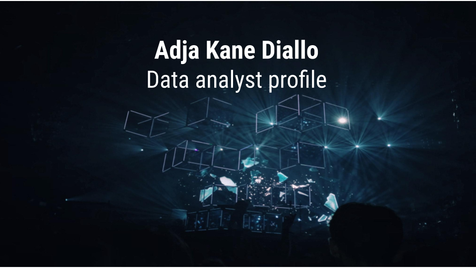

# Hello World! 👋  Welcome to my Github Profile 🔭 !

### This is Adja in software developer mode!😊 Here you can find all my work, from my first lines of code to the most complex projects I have been able to do.

# What are you going to find in my repositories?

### Ironhack Data Analyst Bootcamp

[Ironhack Labs](https://github.com/adjitta/dataptmad0420)

### Data Analytics & Visualization

[Data visualization](https://github.com/adjitta/ih_datamadpt0420_project_m2) Data visualization and exploratory analysis.

### API's

[API](https://github.com/adjitta/ih_datamadpt0420_project_m1) access to Swagger data created by Work Data Initiative.

### Machine Learning

[Diamonds predict](https://github.com/adjitta/-ih_datamadpt0420_project_m3) 

### Contact: 

| LinkedIn |
| :---:| 
||
